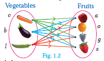
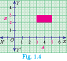
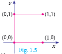
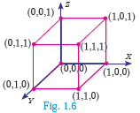

[comment]: <> (katex Header)


[Markdown]: <> (Markdown Refering Website https://www.markdownguide.org/cheat-sheet/)
[Katex]: <> (add the katex entension and header for including maths expression and refer https://katex.org/docs/supported.html)
[Table Creating Webiste]: <> (website for table creating https://www.tablesgenerator.com/markdown_tables)
[Ascii Flow Diagram]: <> (goat diagram website https://asciiflow.com/#/)

# Cartesian Product

#### Illustration 1

Let us consider the following two sets.
A is the set of 3 vegetables and B is the set of 4 fruits. That is,
A = {carrot, brinjal, ladies finger} and B = {apple, orange, grapes, strawberry}
What are the possible ways of choosing a vegetable with a fruit? (Fig.1.2)

| Vegetables (A) | Fruits (B) |    
|----------|----------|
| Carrot (c) | Apple (a) | 
| Brinjal (b)| Orange (o) | 
| Ladies finger (l)| Strawberry (s) |

We can select them in 12 distinct pairs as given below.
(c, a), (c, o), (c, g), (c, s), (b, a), (b, o), (b, g), (b, s), (l, a), (l, o), (l,g), (l, s)

This collection represents the cartesian product of the set of vegetables and set of fruits.

---
**Definition**
- If A and B are two non-empty sets, then the set of all ordered pairs (a, b) such that \\(a \times A, b \times B\\) is called the Cartesian Product of A and B, and is denoted by \\(A \times B\\) .
- Thus, \\(A \times B = \\{(a,b) |a \in A,b \in B\\}\\) (read as A cross B). Also note that  \\(A × \phi = \phi\\)
--- 

---
**Note**
- A × B is the set of all possible ordered pairs between the elements of A and B such that the first coordinate is an element of A and the second coordinate is an element of B.
- B × A is the set of all possible ordered pairs between the elements of A and B such that the first coordinate is an element of B and the second coordinate is an element of A.
- In general \\((a, b) \ne (b, a)\\), in particular, if a = b, then (a, b) = (b, a).
- The “cartesian product” is also referred as “cross product”.
---
---

#### Illustration 2

Let A = {1, 2, 3} and B = {a, b}. Write A ×  B and B × A?

\\(A × B = \\{1,2,3\\} × \\{a,b\\} =\\) {(1,a),(1,b),(2,a),(2,b),(3,a),(3,b)} (as shown in Fig.1.3)

\\(B × A = \\{a,b\\} × \\{1,2,3\\} =\\) {(a,1), (a,2), (a,3),(b,1), (b,2), (b,3)} (as shown in Fig.1.3)

**Thinking Corner**
When will A × B be equal to B × A?

---
**Note**
- In general \\(A ×  B \ne B × A\\), but \\(n(A × B) = n(B × A)\\)
- \\( A ×  B = \phi if and only if A = \phi\\) or \\(B = \phi\\) 
- If \\(n(A) = p\\) and \\(n(B) = q\\) then \\(n(A × B) = pq\\) 
---

#### Recall of standard infinite sets
Natural Numbers \\(\N = \\{1,2,3,4 ...\\};\\)

Whole Numbers \\(\mathbb{W} = \\{0,1,2,3, ...\\};\\)

Integers \\(\Z = \\{..., –2,–1,0,1,2, ...\\};\\)

Rational Numbers \\(\R\\) =  \\( \\{\dfrac{p}{q} |p,q \in \Z, q \ne 0| \\} \\)

Real Numbers \\(\R = \mathbb{Q} \cup \mathbb{Q}'\\) , where \\(\\mathbb{Q'}\\) is the set of all irrational numbers.

#### Illustration 3

For example, let A be the set of numbers in the interval [3, 5] and B be the set of numbers in the interval [2,3]. Then the Cartesian product A ×  B corresponds to the rectangular region shown in the Fig. 1.4. It consists of all points (x, y) within the region.

---
**Progress Check**
1. For any two non-empty sets A and B, A ×  B is called as _____.
2. If n(A ×  B) = 20 and n(A) = 5 then n(B) is _____.
3. If  A = {−1,1} and B = {−1,1} then geometrically describe the set of points of A ×  B .
4. If A, B are the line segments given by the intervals (–4, 3) and (–2, 3) respectively, represent the cartesian product of A and B.
---

---
**Note**

The set of all points in the cartesian plane can be viewed as the set of all ordered pairs (x, y) where x, y are real numbers. In fact, \\(\R\\) × \\(\R\\) is the set of all points which we call as the cartesian plane.

---

---
**Activity 1**
- Let \\(A = \\{ x | x ∈ N,x \le 4 \\}, B = \\{ y | y \in \N, y \lt 3 \\}\\)
Represent A ×  B and B × A in a graph sheet. Can you see the difference between A ×  B and B × A ?
---

#### Example 1.1
If \\(A = \\{1,3,5\\}\\) and \\(B = \\{2,3\\}\\) then

(i) find \\(A × B\\) and \\(B × A.\\)

(ii) Is \\(A ×  B = B × A?\\) If not why?

(iii) Show that \\(n(A × B) = n(B × A) = n(A) × n(B)\\)

**Solution**

Given that \\(A = \\{1,3,5\\}\\) and \\(B = \\{2,3\\}\\)

\\((i) A ×  B = \\{1,3,5\\} × {2,3} = \\{(1,2), (1,3), (3,2), (3,3), (5,2), (5,3)\\} &emsp; &emsp; ...(1)\\)

\\(B × A = \\{2,3\\} × \\{1,3,5\\} = \\{(2,1), (2,3), (2,5), (3,1), (3,3), (3,5)\\} &emsp; &emsp;  ...(2)\\)

(ii) From (1) and (2) we conclude that \\(A ×  B ≠ B × A as (1,2) ≠ (2,1)\\) and \\((1, 3) ≠ (3,1),\\) etc.

(iii) \\(n(A) = 3; n(B) = 2.\\)

From (1) and (2) we observe that, \\(n (A ×  B) = n (B × A) = 6;\\)

we see that, \\(n (A) ×n (B) = 3 × 2 = 6 and n (B) × n (A) = 2×3 = 6 \\)

Hence, \\(n (A ×  B) = n (B × A) = n(A) × n (B) = 6.\\)

Thus, \\(n (A ×  B) = n (B × A) = n(A) × n(B).\\)

#### Example 1.2

If \\(A ×  B = \\{(3,2), (3,4), (5,2), (5,4)\\}\\) then find A and B.

**Solution** 

\\( A ×  B = \\{(3,2), (3,4), (5,2), (5,4)\\} \\)
    
We have \\(A = \\{\\)set of all first coordinates of elements of \\( A B \\} ∴A = \\{3,5\\}\\)

\\(B = \\{\\)set of all second coordinates of elements of \\(A \times B \\} ∴ B = \\{2,4\\}\\)
    
Thus \\(A = \\{3,5\\} \\) and \\(B = \\{2,4\\}\\).

#### Example 1.3

Let A = {\\(x \in \N | 1 \lt x \lt 4\\)}, B = { \\( x \in \mathbb{W}| 0 \le x \lt \\) 2} and C = { \\(x \in  \N | x \gt 3\\)}.

Then verify that

(i) \\( A × (B \cup C) = (A × B) \cup (A × C) \\)         

(ii) \\( A × (B \cap C) = (A × B) \cap (A × C) \\)

**Solution**

\\(A = \\{ x \in \N | 1 \lt x \lt 4 \\} = \\{2, 3\\}, B = \\{ x ∈ \mathbb{W} | 0 \le x \\lt 2\\} = \\{0,1\\}, C = \\{x \in \N | x \lt 3 \\} = \\{1,2\\} \\)

\\( (i) A × (B ∪ C) = (A × B) , (A × C) \\)

\\( B ∪ C = \\{0,1\\} ∪ \\{1,2\\} = \\{0,1,2\\}\\)

\\(A × (B U C) = \\{2,3\\} × \\{0,1,2\\} = \\{(2,0),(2,1),(2,2),(3,0),(3,1),(3,2)\\} &emsp; &emsp; ...(1)\\) 

\\(A ×  B = \\{2,3\\} \times \\{0,1\\} = \\{(2,0),(2,1),(3,0),(3,1)\\}\\)

\\(A ×  C = \\{2,3\\} × \\{1,2\\} = \\{(2,1),(2,2),(3,1),(3,2)\\}\\)

\\((A ×  B) U (A ×  C) = \\{(2,0),(2,1),(3,0),(3,1)\\} , \\{(2,1),(2,2),(3,1),(3,2)\\}\\)

\\( = \\{(2,0),(2,1),(2,2),(3,0),(3,1),(3,2)\\} &emsp; &emsp; ...(2) \\) 

From (1) and (2), \\(A ×  (B U C) = (A × B) U (A × C)\\) is verified.

\\( (ii) A ×  (B ∩ C) = (A ×  B) ∩ (A ×  C)\\)

\\(B \cup = \\{0,1\\} U \\{1,2\\} = \\{1\\}\\)

\\( A ×  (B ∩ C) = \\{2,3\\} \times \\{(2,1),(3,1)\\} &emsp; &emsp; ...(3)\\)

\\(A ×  B = \\{2, 3\\} × \\{0,1\\} = \\{(2, 0),(2,1),(3, 0),(3,1)\\}\\)

\\(A ×  C = \\{2, 3\\} × \\{1,2\\} = \\{(2,1),(2,2),(3,1),(3,2)\\}\\)

\\((A ×  B) ∩ (A ×  C) = \\{(2, 0),(2,1),(3, 0),(3,1)\\} \cup \\{(2,1),(2,2),(3,1),(3,2)\\}\\)

\\(= \\{(2,1),(3,1)\\} &emsp; &emsp; ...(4)\\)

From \\((3) and (4), A ×  (B ∩ C) = (A ×  B) ∩ (A ×  C) \\) is verified.

---
**Note**
 The above two verified properties are called distributive property of cartesian product over union and intersection respectively. In fact, for any three sets A, B, C we have

\\((i) A ×  (B U C) = (A ×  B) U (A ×  C) (ii) A ×  (B ∩ C) = (A ×  B) ∩(A ×  C)\\)

---

##  Cartesian Product of three Sets

If A, B, C are three non-empty sets then the cartesian product of three sets is the set of all possible ordered triplets given by

\\(A ×  B × C = \\{(a,b,c)\\) for all \\(a ∈ A,b ∈ B,c ∈ C\\}\\)

**Illustration for Geometrical understanding of cartesian product of two and three sets**

Let \\(A = \\{0,1\\}, B = \\{0,1\\}, C = \\{0,1\\}\\)

\\(A \times B = \\{0,1\\} \times \\{0,1\\} = \\{(0, 0),(0,1),(1, 0),(1,1)\\}\\)

Representing A x B in the XY - plane we get a picture shown in Fig.1.5. 

\\( (A \times B) \times C = \\{(0, 0),(0,1),(1, 0),(1,1)\\} \times \\{0,1\\} \\)

\\(= \\{(0, 0, 0),(0, 0,1),(0,1, 0),(0,1,1),(1, 0, 0),(1, 0,1)(1,1, 0),(1,1,1)\\}\\)

Representing \\(A \times B \times C\\) in the \\(XYZ\\) - space we get a picture as shown in Fig. 1.6.

Thus,\\(A \times B\\) represent vertices of a square in two dimensions and AxBxC represent vertices of a cube in three dimensions.

---
**Note**
- In general, cartesian product of two non-empty sets provides a shape in two dimensions and cartesian product of three non-empty sets provide an object in three dimensions.
---

## Exercise 1.1

1. Find \\(A \times B , A \times A \\) and \\( B \times A &emsp; (i) A = \\{2,−2, 3\\}\\)  and \\( B = \\{1,−4\\} &emsp; (ii) A = B = \\{p,q\\} (iii) A = \\{m,n\\}; B = \phi \\) 

2. Let \\( A = \\{1,2,3\\}\\) and \\(B = \\{x | x\\) is a prime number less than 10\\(\\}\\). Find \\(A \times B\\) and \\(B \times A\\).
3. If \\(B \times A = \\{(−2, 3),(−2, 4),(0, 3),(0, 4),(3, 3),(3, 4)\\}\\) find A and B.
4. If \\(A = \\{5,6\\} , B = \\{4,5,6\\} , C = \\{5,6,7\\}\\) , Show that \\(A ×  A = (B × B) ∩ (C × C).\\)
5. Given \\(A = \\{1,2,3\\}, B = \\{2,3,5\\}, C = \\{3,4\\}\\) and \\(D = \\{1,3,5\\}\\), check if \\((A \cap C) \times (B \cap D) = (A ×  B) \cap (C × D)\\) is true?
6. Let A = \\({x ∈ W | x < 2} , B = \\{x \in \N |1 \lt x \le 4\\}\\) and \\( C = \\{3,5\\}\\). Verify that

\\((i) A ×  (B \cup C) = (A × B) \cup (A ×  C)\\)

\\((ii) A ×  (B \cap C) = (A \times B) \cap (A \times C)\\)

\\((iii) (A \cup B) × C = (A × C) \cup (B × C)\\)

7. Let A = The set of all natural numbers less than 8, B = The set of all prime numbers less than 8, C = The set of even prime number. Verify that

\\((i) (A \cap B) × C = (A × C) \cap (B × C)\\)

\\((ii) A × (B − C) = (A × B) − (A × C)\\)

