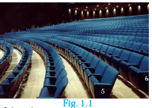

#  Ordered Pair

Observe the seating plan in an auditorium (Fig.1.1). To help orderly occupation of seats, tokens with numbers such as (1,5), (7,16), (3,4), (10,12) etc. are issued. The person who gets (4,10) will go to row 4 and occupy the 10th seat. Thus the first  number denotes the row and the second number, the seat. Which seat will the visitor with token (5,9) occupy? Can he go to 9th row and take the 5th seat? Do (9,5) and (5,9) refer to the same location? No, certainly! What can you say about the tokens (2,3), (6,3) and (10,3)?

This is one example where a pair of numbers, written in a particular order, precisely indicates a location. Such a number pair is called an ordered pair of numbers. This notion is skillfully used to mathematize the concept of a “Relation”.

 
    

